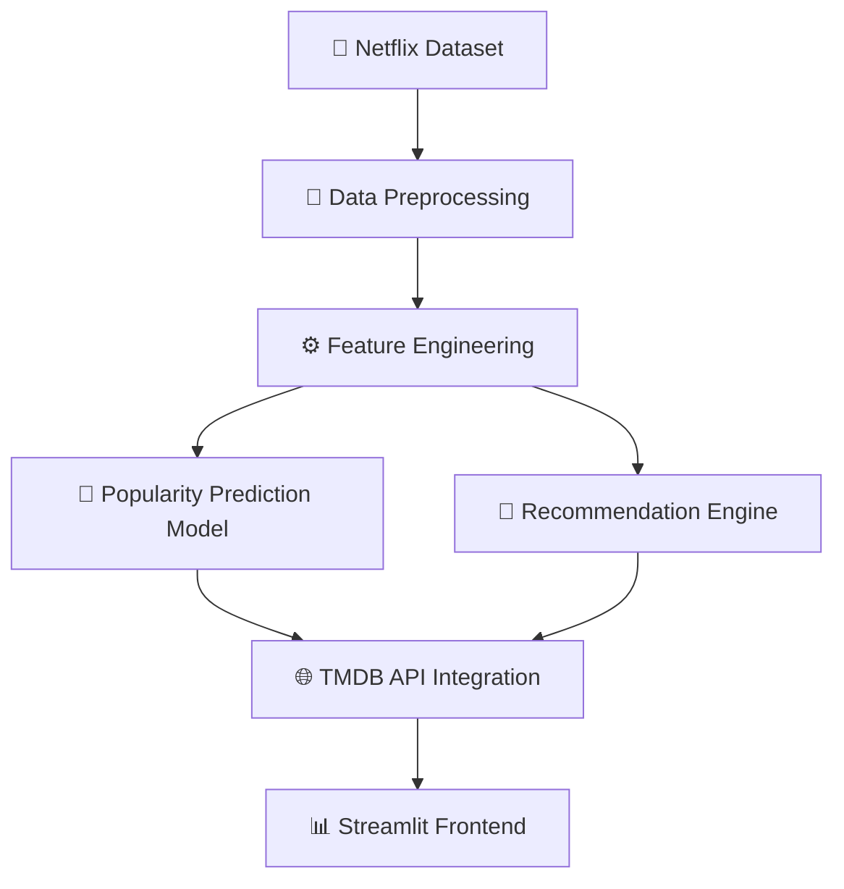

# 🎬 Netflix Analytics, Popularity Prediction & Recommendation System


An **AI-powered Netflix analytics and recommendation platform** integrating **Machine Learning, NLP, Recommendation Systems, and Interactive Dashboards** to simulate a real-world streaming ecosystem.

The platform enables users to predict content popularity, discover personalized recommendations, visualize trends, and explore Netflix content through a modern **Netflix-inspired UI**.

---

## ✨ Key Highlights

✅ AI-powered popularity prediction  
✅ NLP-based recommendation engine  
✅ Real-time TMDB API integration  
✅ Interactive analytics dashboard  
✅ Personalized content discovery  
✅ Multi-page Streamlit application  
✅ Netflix-inspired UI/UX  

---

# 🚀 Features

## 📈 AI-Powered Popularity Prediction

Predict content popularity on a **0–10 scale** using Machine Learning and engineered features.

### Features Used:

📅 Release Year  
🎭 Genre Popularity  
🎬 Content Type  
⏱ Duration  
⭐ Rating  
🌍 Country  

### Model Used:

```text
Random Forest Regressor
```

Outputs:

✔ Predicted popularity score  
✔ Movie metadata  
✔ Real-time posters  
✔ Content insights  

---

## 🎯 Intelligent Recommendation Engine

Designed a content-based recommendation system using NLP techniques.

Recommendation logic combines:

🎭 Genre similarity  
📝 Description similarity  
🎬 Cast similarity  
🎥 Director similarity  
🔗 Franchise relationships  

Example:

```text
Final Destination
↓
Final Destination 2
↓
Final Destination 3
↓
Related Horror Movies
```

---

## 📊 Interactive Analytics Dashboard

Visual insights include:

📌 Top 10 Trending Movies  
📌 Top 10 Trending TV Shows  
📌 Content growth analysis  
📌 Genre distribution  
📌 Rating insights  
📌 Movie vs TV comparison  
📌 Dataset statistics  

---

## 🔍 Personalized Content Discovery

Users can filter content based on:

🎭 Genre  
⭐ Rating  
📅 Release Year  
🎬 Content Type  

Provides a personalized streaming exploration experience.

---

## 🌐 Real-Time TMDB API Integration

Integrated TMDB APIs for:

🖼 Movie posters  
📄 Content metadata  
⚡ Real-time information retrieval  

Optimizations:

✔ Request caching  
✔ Retry mechanisms  
✔ Timeout handling  
✔ Session reuse  
✔ Fallback support  

---

# ▶️ How to Run the Project

Follow these steps to run the application locally:

### 1️⃣ Clone the repository

```bash
git clone https://github.com/yourusername/Netflix-Analytics.git
```

---

### 2️⃣ Navigate to the project directory

```bash
cd Netflix-Analytics
```

---

### 3️⃣ Create a virtual environment (Recommended)

For Windows:

```bash
python -m venv venv
venv\Scripts\activate
```

For Mac/Linux:

```bash
python3 -m venv venv
source venv/bin/activate
```

---

### 4️⃣ Install all dependencies

```bash
pip install -r requirements.txt
```

---

### 5️⃣ Configure TMDB API Key

Create a `.streamlit/secrets.toml` file:

```toml
TMDB_API_KEY="your_api_key_here"
```

Or create a `.env` file:

```env
TMDB_API_KEY=your_api_key_here
```

Get your API key from:

https://www.themoviedb.org/settings/api

---

### 6️⃣ Run the Streamlit application

```bash
streamlit run app.py
```

---

### 7️⃣ Open the application

Streamlit automatically launches:

```text
http://localhost:8501
```

Open it in your browser if it does not launch automatically.

---

## 📂 Application Pages

The project follows a multi-page Streamlit structure:

```bash
pages/
├── 📊 Dashboard.py
├── 🎯 Recommendation.py
├── 🔥 Popularity_Prediction.py
└── 🔍 Content_Filter.py
```

Streamlit automatically detects files inside the `pages/` folder and creates navigation tabs.

---

## ⚠ Common Errors & Fixes

### ModuleNotFoundError

Install dependencies:

```bash
pip install -r requirements.txt
```

---

### TMDB posters not loading

✔ Verify API key  
✔ Check internet connection  
✔ Ensure API request limits are not exceeded

---

### Streamlit command not found

```bash
pip install streamlit
```

or

```bash
python -m streamlit run app.py
```

---

### Port already in use

```bash
streamlit run app.py --server.port 8502
```

# 🧠 Machine Learning Pipeline



---

# ⚙ Data Processing Workflow

## 🧹 Data Preprocessing

Performed:

✔ Missing value handling  
✔ Data cleaning  
✔ Date conversion  
✔ Text preprocessing  
✔ Label encoding  
✔ Numerical transformations  

---

## 🔬 Feature Engineering

Created additional features:

### 📅 Recency Score
Measures content freshness

### 🎭 Genre Score
Measures genre popularity trends

### ⏱ Duration Score
Extracts numerical watch duration

### 🎬 Content-Type Score
Movie vs TV weighting

---

# 🧠 Recommendation Pipeline

Combined textual attributes:

🎭 Genre  
📝 Description  
🎥 Director  
🎬 Cast  

Applied:

✔ TF-IDF Vectorization  
✔ Cosine Similarity Matrix  

Used for generating intelligent recommendations.

---

# 🛠 Tech Stack

### 🎨 Frontend

- Streamlit
- HTML
- CSS

### ⚙ Backend

- Python

### 📊 Data Processing

- Pandas
- NumPy

### 📉 Visualization

- Matplotlib
- Seaborn

### 🤖 Machine Learning

- Scikit-Learn
- Random Forest Regressor
- TF-IDF Vectorizer
- Cosine Similarity
- Label Encoder

### 🌐 APIs

- TMDB API
- Requests

### ☁ Deployment

- Docker
- GitHub
- Streamlit Cloud

---

# 📂 Project Structure

```bash
Netflix-Analytics/
│
├── app.py
├── requirements.txt
├── README.md
│
├── pages/
│   ├── Dashboard.py
│   ├── Recommendation.py
│   ├── Popularity_Prediction.py
│   └── Content_Filter.py
│
├── data/
├── models/
├── assets/
└── notebooks/
```

---

# ⚡ Installation

Clone repository:

```bash
git clone https://github.com/yourusername/Netflix-Analytics.git
```

Move into project:

```bash
cd Netflix-Analytics
```

Install dependencies:

```bash
pip install -r requirements.txt
```

Run app:

```bash
streamlit run app.py
```

---

# 🔮 Future Enhancements

🚀 Hybrid recommendation system  
🚀 Collaborative filtering  
🚀 Watchlists  
🚀 User authentication  
🚀 Deep learning recommendations  
🚀 Cloud deployment pipeline  

---

# 💡 Skills Demonstrated

🧠 Machine Learning  
🎯 Recommendation Systems  
📊 Data Analytics  
🔍 NLP  
⚙ Feature Engineering  
🌐 API Integration  
📈 Dashboard Development  
💻 Full Stack Development  

---

# 👨‍💻 Author

### Viraj Raut

AI/ML Student | Full Stack Developer | Machine Learning Enthusiast

🔗 GitHub: https://github.com/yourusername

💼 LinkedIn: https://linkedin.com/in/yourprofile
